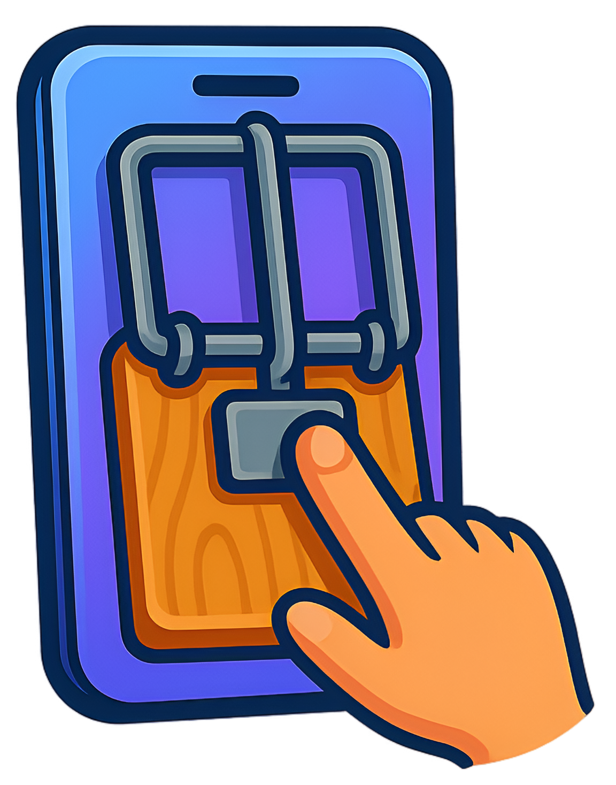
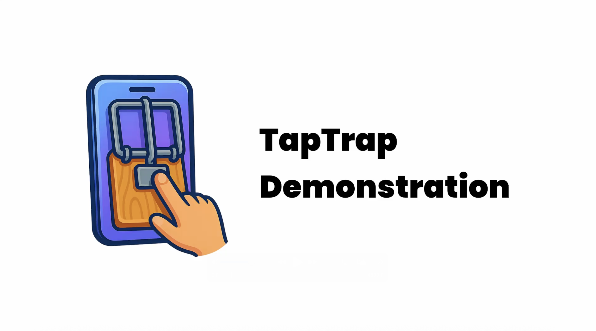

# TapTrap: Animation-Driven Tapjacking on Android

> 🚧 **Work in Progress:** This project is currently a work-in-progress. Instructions may be wrong or incomplete.

This repository contains the artifacts of the paper "TapTrap: Animation-Driven Tapjacking on Android", to be presented at [USENIX 2025](https://www.usenix.org/conference/usenixsecurity25).

[](https://taptrap.click/paper)
[](https://taptrap.click/artifact-appendix)
[](https://taptrap.click/presentation)
[](https://taptrap.click/poster)
[![Website](https://img.shields.io/badge/Website-blue.svg?logo=data:image/svg%2bxml;base64,PHN2ZyB4bWxucz0iaHR0cDovL3d3dy53My5vcmcvMjAwMC9zdmciIGhlaWdodD0iMjRweCIgdmlld0JveD0iMCAtOTYwIDk2MCA5NjAiIHdpZHRoPSIyNHB4IiBmaWxsPSIjZmZmIj48cGF0aCBkPSJNNDgwLTgwcS04MiAwLTE1NS0zMS41dC0xMjcuNS04NlExNDMtMjUyIDExMS41LTMyNVQ4MC00ODBxMC04MyAzMS41LTE1NS41dDg2LTEyN1EyNTItODE3IDMyNS04NDguNVQ0ODAtODgwcTgzIDAgMTU1LjUgMzEuNXQxMjcgODZxNTQuNSA1NC41IDg2IDEyN1Q4ODAtNDgwcTAgODItMzEuNSAxNTV0LTg2IDEyNy41cS01NC41IDU0LjUtMTI3IDg2VDQ4MC04MFptMC04MnEyNi0zNiA0NS03NXQzMS04M0g0MDRxMTIgNDQgMzEgODN0NDUgNzVabS0xMDQtMTZxLTE4LTMzLTMxLjUtNjguNVQzMjItMzIwSDIwNHEyOSA1MCA3Mi41IDg3dDk5LjUgNTVabTIwOCAwcTU2LTE4IDk5LjUtNTV0NzIuNS04N0g2MzhxLTkgMzgtMjIuNSA3My41VDU4NC0xNzhaTTE3MC00MDBoMTM2cS0zLTIwLTQuNS0zOS41VDMwMC00ODBxMC0yMSAxLjUtNDAuNVQzMDYtNTYwSDE3MHEtNSAyMC03LjUgMzkuNVQxNjAtNDgwcTAgMjEgMi41IDQwLjVUMTcwLTQwMFptMjE2IDBoMTg4cTMtMjAgNC41LTM5LjVUNTgwLTQ4MHEwLTIxLTEuNS00MC41VDU3NC01NjBIMzg2cS0zIDIwLTQuNSAzOS41VDM4MC00ODBxMCAyMSAxLjUgNDAuNVQzODYtNDAwWm0yNjggMGgxMzZxNS0yMCA3LjUtMzkuNVQ4MDAtNDgwcTAtMjEtMi41LTQwLjVUNzkwLTU2MEg2NTRxMyAyMCA0LjUgMzkuNVQ2NjAtNDgwcTAgMjEtMS41IDQwLjVUNjU0LTQwMFptLTE2LTI0MGgxMThxLTI5LTUwLTcyLjUtODdUNTg0LTc4MnExOCAzMyAzMS41IDY4LjVUNjM4LTY0MFptLTIzNCAwaDE1MnEtMTItNDQtMzEtODN0LTQ1LTc1cS0yNiAzNi00NSA3NXQtMzEgODNabS0yMDAgMGgxMThxOS0zOCAyMi41LTczLjVUMzc2LTc4MnEtNTYgMTgtOTkuNSA1NVQyMDQtNjQwWiIvPjwvc3ZnPg==)](https://taptrap.click)
[](https://doi.org/10.5281/zenodo.15519677)

## Abstract

Users interact with mobile devices under the assumption that the graphical user interface (GUI) accurately reflects their actions, a trust fundamental to the user experience. In this work, we present TapTrap, a novel attack that enables zeropermission apps to exploit UI animations to undermine this trust relationship. TapTrap can be used by a malicious app to stealthily bypass Android’s permission system and gain access to sensitive data or execute destructive actions, such as wiping the device without user approval. Its impact extends beyond the Android ecosystem, enabling tapjacking and Web clickjacking. TapTrap is able to bypass existing tapjacking defenses, as those are targeted toward overlays. Our novel approach, instead, abuses activity transition animations and is effective even on Android 15. We analyzed 99,705 apps from the Play Store to assess whether TapTrap is actively exploited in the wild. Our analysis found no evidence of such exploitation. Additionally, we conducted a large-scale study on these apps and discovered that 76.3% of apps are vulnerable to TapTrap. Finally, we evaluated the real-world feasibility of TapTrap through a user study with 20 participants, showing that all of them failed to notice at least one attack variant. Our findings have resulted in two assigned CVEs.

## File structure

The repository is organized as follows:

- [`dataset_preparation`](dataset_preparation/README.md) – Scraping and downloading apps, APK merging
- [`vulnerable_app_detection`](vulnerable_app_detection/README.md) – Static detection of vulnerable apps
- [`malicious_app_detection`](malicious_app_detection/README.md) – Static detection of malicious apps
- [`user_study`](user_study/README.md) – Materials and code for the user study
- [`poc`](poc/README.md) – Proof-of-concept TapTrap implementation
- [`reproducibility`](reproducibility/README.md) – Scripts for reproducing the paper results
- [`paper_licenses`](paper_licenses/) – Licenses for third-party resources used in the paper
- [`assets`](assets/) – Logo and demonstration videos

## Getting Started

To run a specific analysis pipeline, navigate to the corresponding folder (e.g., `vulnerable_app_detection`) and follow the steps in its `README.md`.

## Reproducibility

To reproduce the experiments and results reported in the paper, please follow the instructions provided in the [Artifact Appendix](https://taptrap.click/artifact-appendix).

## Demonstration

This video demonstrates TapTrap. In the example, the user plays a game that secretly opens the browser and tricks them into granting camera permissions to a malicious website. The hidden screen is semi-transparent for demonstration purposes.

[](assets/taptrap_poc.mov)

## CVEs

[](https://nvd.nist.gov/vuln/detail/CVE-2025-3067) 

> [!NOTE] 
> Inappropriate implementation in Custom Tabs in Google Chrome on Android prior to 135.0.7049.52 allowed a remote attacker who convinced a user to engage in specific UI gestures to perform privilege escalation via a crafted app.

[](https://nvd.nist.gov/vuln/detail/CVE-2025-1939) 
> [!NOTE] 
> Android apps can load web pages using the Custom Tabs feature. This feature supports a transition animation that could have been used to trick a user into granting sensitive permissions by hiding what the user was actually clicking. This vulnerability affects Firefox < 136.


## Cite The Paper

To cite our work, please use the following BibTeX entry:

```bibtex
% Final fields to be updated after publication
@inproceedings{taptrap_beer,
  author    = {Philipp Beer and Marco Squarcina and Sebastian Roth and Martina Lindorfer},
  title     = {{TapTrap: Animation-Driven Tapjacking on Android}},
  booktitle = {To appear in: 34th USENIX Security Symposium (USENIX Security 25)},
  year      = {2025},
  address   = {Seattle, WA},
  pages     = {XXXX--XXXX},
  publisher = {USENIX Association},
  url       = {XXXXXXXX},
  isbn      = {XXX-X-XXXXXX-XX-X},
  month     = aug
}
```

## Contacts

- **Philipp Beer** - [philipp.beer@tuwien.ac.at](mailto:philipp.beer@tuwien.ac.at)
- **Marco Squarcina** - [marco.squarcina@tuwien.ac.at](mailto:marco.squarcina@tuwien.ac.at)
- **Sebastian Roth** - [sebastian.roth@uni-bayreuth.de](mailto:sebastian.roth@uni-bayreuth.de)
- **Martina Lindorfer** - [martina@seclab.wien](mailto:martina@seclab.wien)

You can find more information on our website [https://taptrap.click](https://taptrap.click).

## License Notice

This repository is released under the MIT License. See [`LICENSE`](LICENSE) for details.

This project includes third-party software:
- [`APKEditor`](https://github.com/REAndroid/APKEditor) by REAndroid is licensed under the [Apache License, Version 2.0](dataset_preparation/merger/APKEditor-LICENSE).
- [`rs-google-play`](https://github.com/EFForg/rs-google-play) by the EFF is licensed under the [MIT license](dataset_preparation/downloader/rs-google-play/LICENSE).
- [`apkeep`](https://github.com/EFForg/apkeep) by the EFF is licensed under the [MIT license](dataset_preparation/downloader/apkeep/LICENSE).

The paper includes icons released, among others, under the [GPL](paper_licenses/LICENSE-gpl.txt) and [MIT](paper_licenses/LICENSE-vmware.txt) licenses. 