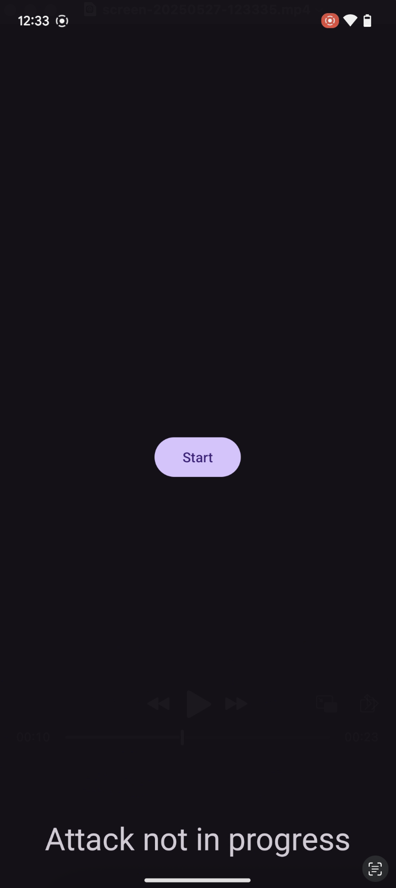

# TapTrap Proof of Concept

Proof of concept implementation of TapTrap that requests camera permissions.

## Folder structure

- [`app/src/main/java/click/taptrap/poc/MainActivity.java`](app/src/main/java/click/taptrap/poc/MainActivity.java) - Main activity that performs the TapTrap attack
- [`app/src/main/res/anim/fade_in.xml`](app/src/main/res/anim/fade_in.xml) - Malicious animation used to perform TapTrap
- [`app/src/main/res/layout/activity_main.xml`](app/src/main/res/layout/activity_main.xml) - Layout file for the main activity
- [`Dockerfile`](Dockerfile) - Dockerfile for containerization
- [`gradle/`](gradle/) - Gradle wrapper files (used for native builds, not in Docker)

## Documentation

The TapTrap proof-of-concept (PoC) demonstrates a permission-based variant of the TapTrap attack by targeting the system-level camera permission.
- Pressing Start initiates the attack sequence.
- The user is prompted to click “Click here”, which is designed to lure them into unintentionally granting camera access.
- The attack window lasts for 6 seconds. If the permission is not granted within this window, the attack is retried.
- The attack is considered successful if the app displays "Permission granted".

You can manually verify the permission state by navigating to *Settings* > *Security & Privacy* > *Privacy controls* > *Permission manager* > *Camera*.

>[!NOTE]
> The app is optimized for a Pixel 6a running Android 15. On other devices or OS versios, the positioning of the button in interplay with the *Allow* button of the permission prompt
> may have to be adjusted. To change the animation, go to [`app/src/main/res/anim/fade_in.xml`](app/src/main/res/anim/fade_in.xml) and change the `fromXDelta`, `toXDelta`, `fromYDelta`, `toYDelta` parameters accordingly.

### Demonstration

The following video demonstrates the proof of concept:

[](../assets/poc_demo.mp4)

## Usage

### Building the app

#### Docker-based Build

> [!NOTE]
> **Prerequisites:** 
> - Docker (refer to [this guide](https://www.docker.com/get-started/) to install it)

1. Build the image. On ARM systems (e.g., Mac with Apple Silicon), include `--platform=linux/amd64`:
```sh
docker build --platform=linux/amd64 -t taptrap_poc .
```
2. Run the container and replace `<OUT_DIR>` with the directory you want to store the APK in:
```sh
docker run --rm \
  -v <OUT_DIR>:/apk-output \
  taptrap_poc
```
3. The built APK will be saved to:
```sh
<OUT_DIR>/click.taptrap.poc.apk
```

>[!WARNING]
> `<OUT_DIR>` must be an **absolute path**.

#### Native Build

>[!NOTE]
> **Prerequisite**: Android Studio is installed and `ANDROID_HOME` points to the SDK location.

##### Option A: Android Studio
1. Open the project in Android Studio.
2. Go to *Build* > *Build App Bundle(s) / APK(s)* > *Build APK(s)*. 
3. The APK will be located at:
```sh
app/build/outputs/apk/debug/app-debug.apk
```

##### Option B: Command-line

1. Ensure `local.properties` points to the Android SDK:
```sh
echo "sdk.dir=$ANDROID_HOME" > local.properties
```
2. Run the build:
```sh
./gradlew assembleDebug
```
3. The APK will be located at:
```sh
app/build/outputs/apk/debug/app-debug.apk
```

### Install the app

>[!NOTE]
>**Prerequisite**: ADB must be installed and available in your `PATH`.

1. Connect a device and enable USB debugging (*Settings* > *About phone* > Tap *Build number* 7x, then *Developer Options* > *Enable USB Debugging*). USB debugging does not need to be enabled on emulators.
2. Install the APK and replace `<APK>` with the path to the APK:
```sh
adb install <APK>
```

## Troubleshooting

#### The permissions are not granted when I use the app

The positioning of the button/zoom of the animation probably does not fit your device. To modify the animation, edit the [`app/src/main/res/anim/fade_in.xml`](app/src/main/res/anim/fade_in.xml) file and adjust `fromXDelta`, `toXDelta`, `fromYDelta`, and `toYDelta`. You can also increase `alpha` to debug.