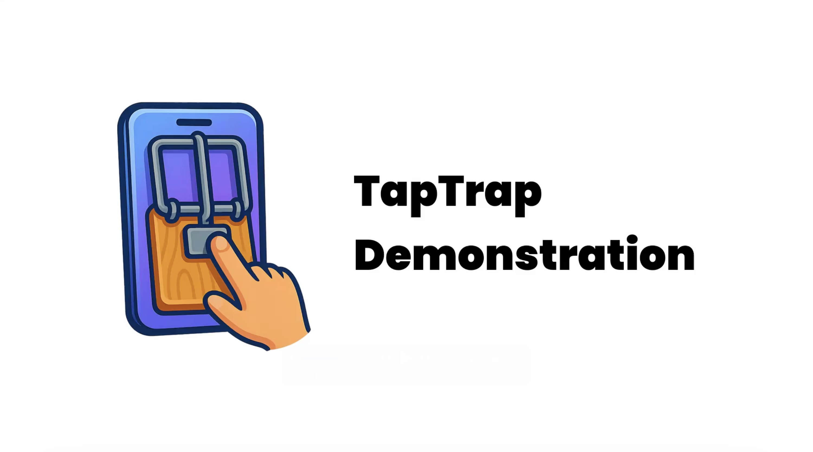

# User Study

This directory contains the artifacts of the user study.

## Folder Structure

- [`study_documents/`](study_documents/) – Consent forms, information sheet, and questionnaires used in the study.
- [`KillTheBugs/`](KillTheBugs/) – The Android app used in the study.
- [`web_app/`](web_app/) – The website loaded by the app in Levels 1 and 2.

## KillTheBugs

KillTheBugs exploits TapTrap. It consists of three levels:
- Level 1-2: Opens a website in a Custom Tab that requests location and camera permission
- Level 3: Opens the device admin settings page and requests device admin permissions, then locks the device

The app supports an admin mode that allows to see what is going on behind the scenes. To activate the admin mode, tap the top right corner on the main page.

### Demonstration

This video demonstrates the *KillTheBugs* app:

[](../assets/taptrap_demo.mp4)

## Prepare and run KillTheBugs

>[!IMPORTANT]
> The app is optimized for a **Pixel 6a running Android 15**. On other devices or OS versions, button alignment with the permission prompts may require adjustment.  
> To modify the animation, edit the `KillTheBugs/app/src/main/res/anim/fade_in_*.xml` files and adjust `fromXDelta`, `toXDelta`, `fromYDelta`, and `toYDelta`.  
> Furthermore, Chrome needs to be granted camera, location, and microphone permissions. The app will only work on Chrome <= 134 installed.
>  
> The app can also run in an Android emulator. To start the emulator, run:  
> ```
> reproducibility/start_emulator.sh
> ```  
> Note: Emulator behavior may differ slightly from physical devices (e.g., the screen may dim during the permission prompts).

KillTheBugs relies on a website to be loaded in Levels 1 and 2. The app is configured to use the website hosted at https://killthebugs.taptrap.click.
However, we also provide instructions to host the website locally.

### Website (optional)

> [!NOTE]
> **Prerequisites:** 
> - Docker (refer to [this guide](https://www.docker.com/get-started/) to install it)

If you prefer to host the website locally (instead of using [https://killthebugs.taptrap.click](https://killthebugs.taptrap.click)), follow these steps:

- Build the Docker image:
  ```sh
  docker build -t taptrap-web web_app
```
- Run the Web server:
```sh
docker run -p 5002:80 taptrap-web
```
- The Web server now runs on port `5002`.
- Change the value of `webapp` in `KillTheBugs/app/src/main/res/values/strings.xml` to the URL you are hosting the website on, e.g., `http://10.0.2.2:5002` if you are running the app in an emulator (`10.0.2.2` refers to `localhost` from within the emulator)

>[!IMPORTANT]
> Because `http://*` URLs are not treated as secure origins by Chrome, the permission prompt will silently fail.
> To prevent this, go to `chrome://flags/#unsafely-treat-insecure-origin-as-secure` in Google Chrome on the Android device, enable "Insecure origins treated as secure" and add `http://10.0.2.2:5002` as a secure origin.

### Building the app

#### Docker-based Build

> [!NOTE]
> **Prerequisites:** 
> - Docker (refer to [this guide](https://www.docker.com/get-started/) to install it)

1. Build the image. On ARM systems (e.g., Mac with Apple Silicon), include `--platform=linux/amd64`:
```sh
docker build --platform=linux/amd64 -t taptrap_killthebugs .
```
1. Run the container and replace `<OUT_DIR>` with the directory you want to store the APK in:
```sh
docker run --rm \
  -v <OUT_DIR>:/apk-output \
  taptrap_killthebugs
```
1. The built APK will be saved to:
```sh
<OUT_DIR>/app-debug.apk
```

>[!WARNING]
> `<OUT_DIR>` must be an **absolute path**.

#### Native Build

>[!NOTE]
> **Prerequisite**: Android Studio is installed and `ANDROID_HOME` points to the SDK location.

##### Option A: Android Studio
1. Open the project in Android Studio.
2. Go to *Build* > *Build App Bundle(s) / APK(s)* > *Build APK(s)*. 
3. The APK will be located at:
```sh
app/build/outputs/apk/debug/app-debug.apk
```

##### Option B: Command-line

>[!NOTE]
> **Prerequisite**: The Android SDK is installed and `ANDROID_HOME` points to the SDK location.

1. Ensure `local.properties` points to the Android SDK:
```sh
echo "sdk.dir=$ANDROID_HOME" > local.properties
```
2. Run the build:
```sh
./gradlew assembleDebug
```
3. The APK will be located at:
```sh
app/build/outputs/apk/debug/app-debug.apk
```

### Install the app

>[!NOTE]
>**Prerequisite**: ADB must be installed and available in your `PATH`.

1. Connect a device and enable USB debugging (*Settings* > *About phone* > Tap *Build number* 7x, then *Developer Options* > *Enable USB Debugging*). USB Debugging does not need to be enabled for emulators.
2. Install the APK and replace `<APK_PATH>` with the path to the APK:
```sh
adb install <APK_PATH>
```

## Troubleshooting

#### permission denied: ./reproducibility/start_emulator.sh

This error indicates that the script does not have executable permissions. To fix this, run the following command:

```bash
chmod +x ./reproducibility/start_emulator.sh
```

#### The permissions are not granted when I play the app

There can be two main reasons for this:

1. You are using a version of Chrome that has fixed the vulnerability. Downgrade Chrome (go to the Chrome app info in Settings and choose "Uninstall Updates")
2. The positioning of the button/zoom of the animation does not fit your device. To modify the animation, edit the `KillTheBugs/app/src/main/res/anim/fade_in_*.xml` files and adjust `fromXDelta`, `toXDelta`, `fromYDelta`, and `toYDelta`. You can also make use of the admin mode of the app to debug and fix the positioning.